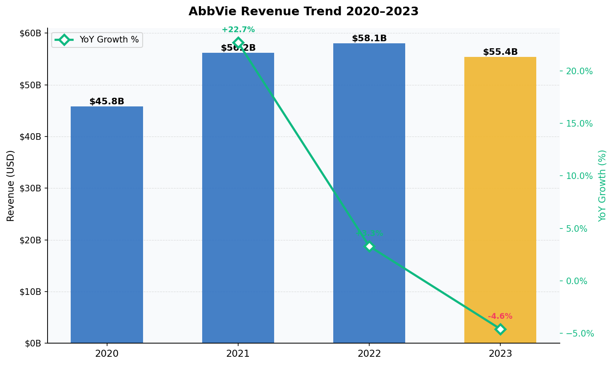
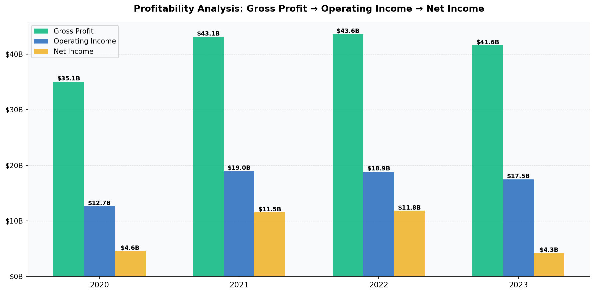
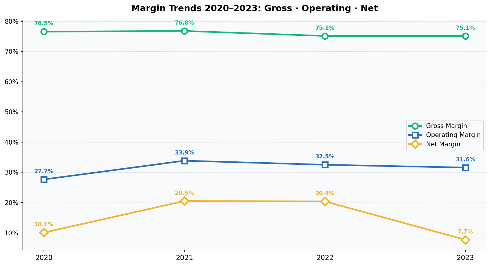
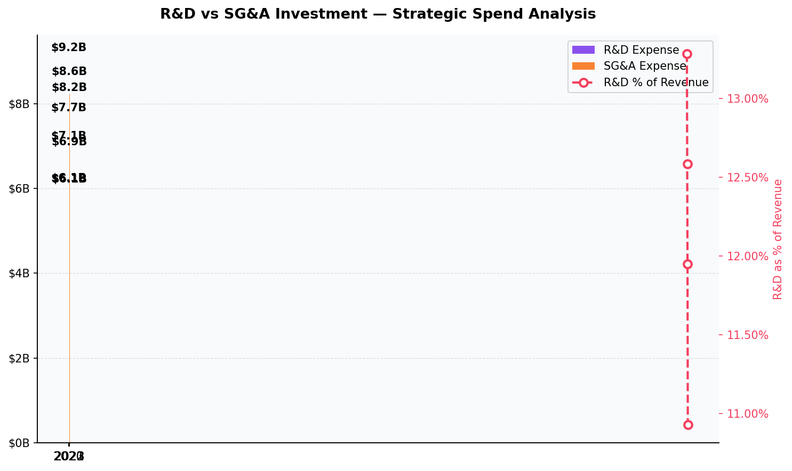
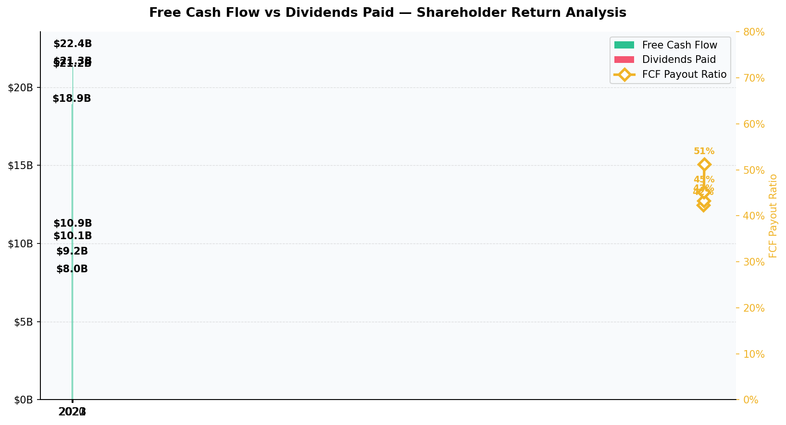
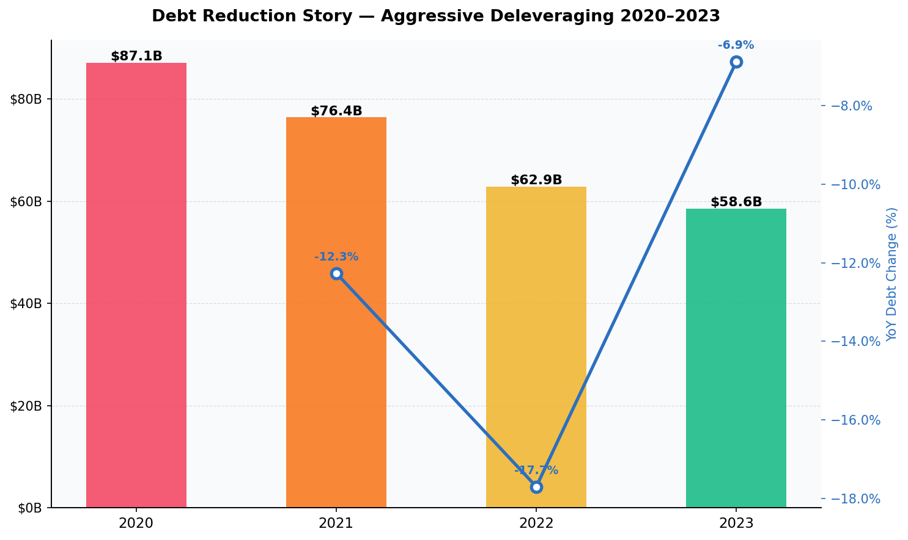
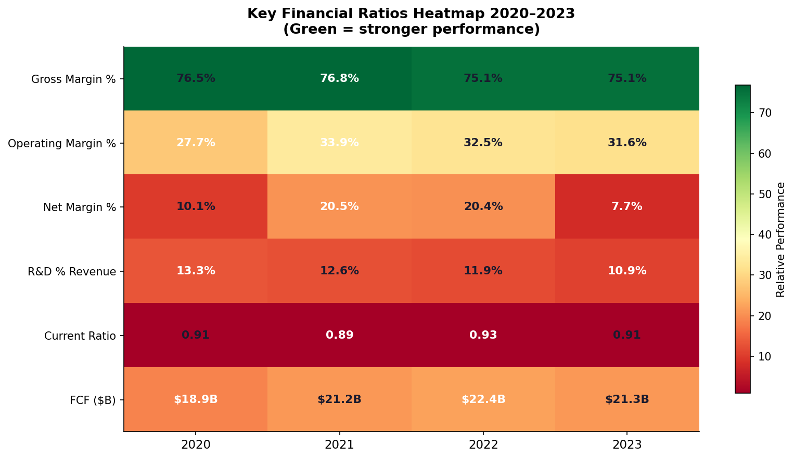
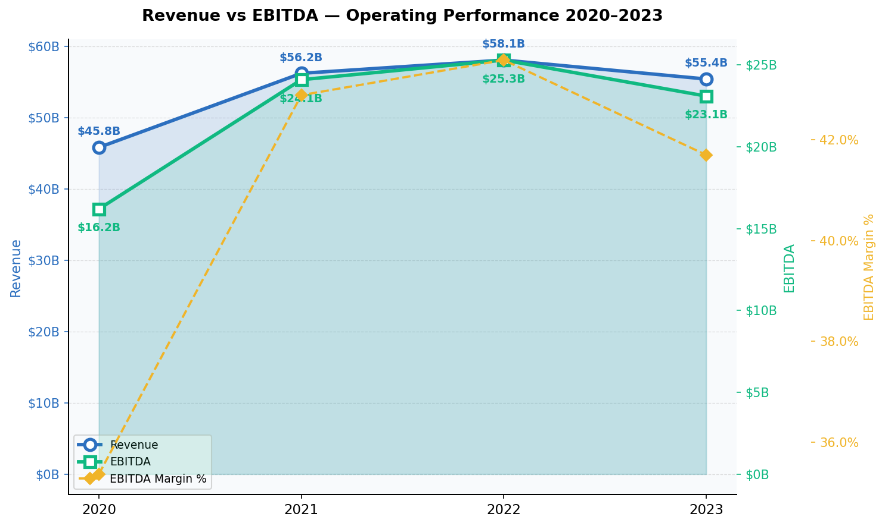
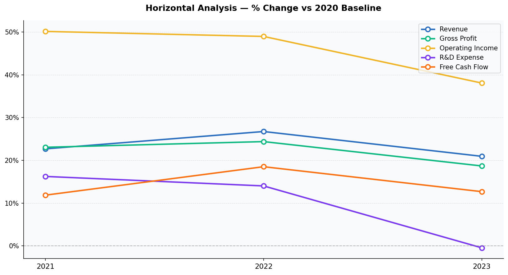
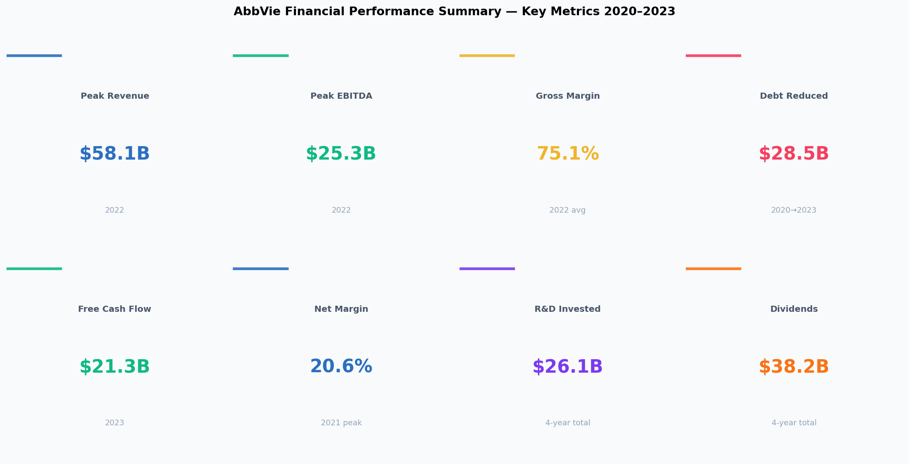

# AbbVie Inc. Financial Performance Analysis 2020–2023

> A 4-year deep-dive into AbbVie's financials profitability, liquidity, cash flow, and strategic growth signals from SEC 10-K filings.

**Tools:** Python · Pandas · Matplotlib · NumPy  
**Data Source:** AbbVie Annual Reports & SEC 10-K Filings (2020–2023)  
**Analysis Type:** Vertical Analysis · Horizontal Analysis · Ratio Analysis · Trend Analysis

---

## The Business Problem

AbbVie completed one of the largest pharma acquisitions in history buying Allergan for $63B in 2020. The question this analysis answers:

**How has AbbVie's financial performance evolved post-acquisition, and what does it signal about its long-term trajectory?**

---

## Key Findings

**1. Revenue grew 27% from 2020 to peak in 2022**  
The Allergan acquisition drove significant expansion. The 2023 pullback to $55.4B reflects Humira biosimilar pressure not core operational weakness.

**2. Gross margin held above 75% for all 4 years**  
Despite revenue normalization in 2023, AbbVie maintained exceptional pricing power gross margin never dropped below 75.1%.

**3. $28.5B in debt eliminated in just 3 years**  
Total debt fell from $87.1B (2020) to $58.6B (2023) a 33% reduction funded entirely by operating cash flow. Best-in-class balance sheet execution.

**4. EBITDA margin averaged 43% far above the pharma average of 20–25%**  
Reflects AbbVie's portfolio of high-margin specialty and immunology drugs.

**5. $21B+ in free cash flow sustains dividends and future M&A**  
FCF comfortably covers $10.9B in annual dividends while leaving capital for pipeline investment.

---

## Visualizations

### Revenue Trend 2020–2023


### Profitability: Gross Profit → Operating Income → Net Income


### Margin Trends Gross · Operating · Net


### R&D vs SG&A Investment


### Free Cash Flow vs Dividends


### Debt Reduction Story


### Financial Ratios Heatmap


### Revenue vs EBITDA


### Horizontal Analysis % Change vs 2020 Baseline


### KPI Summary Dashboard


---

## Financial Summary

| Metric | 2020 | 2021 | 2022 | 2023 |
| :--- | ---: | ---: | ---: | ---: |
| Revenue | $45.8B | $56.2B | $58.1B | $55.4B |
| Gross Profit | $35.1B | $43.1B | $43.6B | $41.6B |
| EBITDA | $16.2B | $24.1B | $25.3B | $23.1B |
| Net Income | $4.6B | $11.5B | $11.8B | $4.3B |
| Free Cash Flow | $18.9B | $21.2B | $22.4B | $21.3B |
| Total Debt | $87.1B | $76.4B | $62.9B | $58.6B |

---

## Business Recommendations

| Priority | Recommendation |
| :--- | :--- |
| High | Accelerate Skyrizi & Rinvoq to offset Humira biosimilar pressure |
| High | Continue deleveraging target sub-$50B debt by 2025 |
| Medium | Reinvest FCF into R&D pipeline to prevent long-term revenue cliff |
| Medium | Monitor current ratio FCF covers but liquidity margin is tight |

---

## How to Run

```bash
git clone https://github.com/Cinco33/Data_Science_Portfolio.git
cd Data_Science_Portfolio/Financial_Performance_AbbVie
pip install pandas numpy matplotlib
jupyter notebook AbbVie_Financial_Performance_Analysis.ipynb
```

---
---

*Part of the [Darius Nobles Data Science Portfolio](https://github.com/Cinco33/Data_Science_Portfolio)*  
*[LinkedIn](https://www.linkedin.com/in/dariusnobles/) · [Portfolio Website](https://dariusnobles.netlify.app/)*
